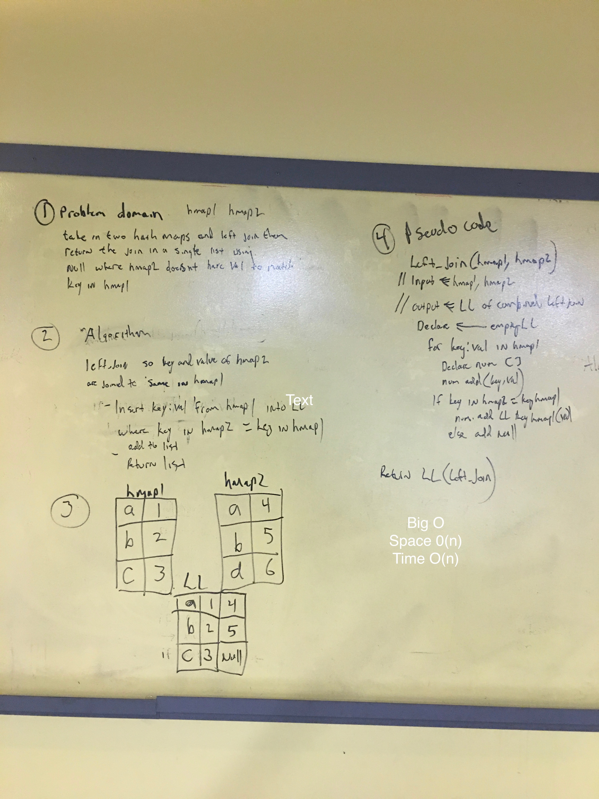

# left_join
**Author** : Jay Adams
**Version**: 0.2.0

## Overview

## Spec
---------------
Write a function that accepts two hash_maps and returns a list of the key from hash_map1 with the value of both.  Null where hash_map2 has no value to match key. 

## Assets

## Architechture
Python 3.6.4
ENV
Pytest

## API
None

## Change log
7d1bf6c (HEAD -> left_join) added code for left_join
d662f11 add needed files from past challenges
dc77639 scaffold